# 🎰 SLOT MACHINE - PYTHON CASINO EDITION 🎰

<p align="center">
  
</p>

<p align="center">
  <a href="#">
    
  </a>
</p>

<p align="center">
  
  
  
  
</p>

<p align="center">
  
  
  
  
</p>

<p align="center">
  
</p>

---

<!-- ANIMATED SLOT MACHINE ASCII -->
<p align="center">
  <pre>
    ╔══════════════════════════════════════════════════════════════╗
    ║                    🎰  SLOT MACHINE  🎰                     ║
    ╠══════════════════════════════════════════════════════════════╣
    ║                                                              ║
    ║           ┌─────┐  ┌─────┐  ┌─────┐  ┌─────┐  ┌─────┐      ║
    ║           │  💎 │  │  7  │  │ BAR │  │ 🍒  │  │ 🍋  │      ║
    ║           └─────┘  └─────┘  └─────┘  └─────┘  └─────┘      ║
    ║                                                              ║
    ║              ╔═══════════════════════════════╗              ║
    ║              ║       ╔═══╗ ╔═══╗ ╔═══╗       ║              ║
    ║              ║       ║ 💎 ║ ║ 💎 ║ ║ 💎 ║       ║              ║
    ║              ║       ╚═══╝ ╚═══╝ ╚═══╝       ║              ║
    ║              ║        J A C K P O T !        ║              ║
    ║              ╚═══════════════════════════════╝              ║
    ║                                                              ║
    ║            🏆 10X MULTIPLIER  •  🎯 FREE SPINS             ║
    ║                                                              ║
    ╚══════════════════════════════════════════════════════════════╝
  </pre>
</p>

---

## 🎯 **WELCOME TO THE ULTIMATE SLOT EXPERIENCE!**

**Slot Machine** is a **professional-grade, terminal-based casino simulator** built with pure Python. Experience the thrill of Vegas right in your command line! With stunning visuals, realistic mechanics, and deep progression systems, this isn't just a game—it's an **addiction simulator** (in the best way possible)! 🎰

<p align="center">
  
</p>

## ✨ **FEATURES THAT'LL MAKE YOU SPIN ALL NIGHT**

### 🎮 **CORE GAMEPLAY**
| Feature | Description | Cool Factor |
|--------|-------------|-------------|
| 🎰 **3x3 Grid** | Classic slot machine layout | ⭐⭐⭐⭐⭐ |
| 💎 **6 Unique Symbols** | Diamond, 7, BAR, Cherry, Lemon, Orange | ⭐⭐⭐⭐⭐ |
| 📊 **Multi-Line Betting** | Bet on 1-3 lines simultaneously | ⭐⭐⭐⭐ |
| 💰 **Dynamic Betting** | $1 - $100 per line | ⭐⭐⭐⭐ |

### 🏆 **BONUS FEATURES**
```python
🔥 JACKPOT:     All 💎 = 10x MULTIPLIER!
🎯 FREE SPINS:  10% chance to win 1-3 free spins
💾 AUTO-SAVE:   Never lose progress
📊 STATS:       Track every spin, win, and loss
🏅 HIGH SCORE:  Beat your personal best!
```

### 🎨 **VISUAL EXPERIENCE**
```
🌈 Full RGB Color Support (Colorama)
🎭 Beautiful ASCII Art Interface
📱 Clean, Organized Layout
⚡ Smooth Animations
🖥️ Cross-Platform (Win/Mac/Linux)
```

---

## 🚀 **LIGHTNING FAST INSTALLATION**

### 📋 **Option 1: No Frills (Works Everywhere)**
```bash
# 1. Clone the casino
git clone https://github.com/yourusername/slot-machine.git

# 2. Enter the vault
cd slot-machine

# 3. Start winning!
python slot_machine.py
```

### 🎨 **Option 2: Full Experience (With Colors)**
```bash
# 1. Install color magic
pip install colorama

# 2. Run in style!
python slot_machine.py
```

**⚠️ THAT'S IT! Zero other dependencies. Pure Python power!**

---

## 🎮 **HOW TO PLAY - BECOME A PRO IN 60 SECONDS**

<p align="center">
  
</p>

### 🎯 **STEP 1: START YOUR JOURNEY**
```python
💰 Starting balance: $100
💡 Type 'h' for help, 'q' to quit
```

### 🎯 **STEP 2: PLACE YOUR BETS**
```python
📊 Enter number of lines to bet on: 3
🎲 How much would you like to bet per line? $10
💸 Total bet: $30
```

### 🎯 **STEP 3: SPIN & WIN!**
```python
╔════════════════════════════════╗
║         SLOT MACHINE          ║
╠════════════════════════════════╣
║   💎  |  7   |  🍒            ║
║   7   |  💎  |  🍋            ║
║   BAR |  🍒  |  🍊            ║
╚════════════════════════════════╝

💰 Won:        $50
💸 Bet:        $30
📊 Net:        $20
💵 Balance:    $120
🎯 Win Lines:  2
```

---

## 💎 **SYMBOL VALUES & PAYOUTS**

<p align="center">
  <table>
    <tr>
      <th align="center">Symbol</th>
      <th align="center">Name</th>
      <th align="center">Count</th>
      <th align="center">Value</th>
      <th align="center">Jackpot</th>
    </tr>
    <tr>
      <td align="center"><b>ğŸ’</b></td>
      <td align="center">Diamond</td>
      <td align="center">2</td>
      <td align="center"><b>$50</b></td>
      <td align="center"><b style="color:gold;">10x!</b></td>
    </tr>
    <tr>
      <td align="center"><b>7</b></td>
      <td align="center">Seven</td>
      <td align="center">3</td>
      <td align="center"><b>$20</b></td>
      <td align="center">-</td>
    </tr>
    <tr>
      <td align="center"><b>BAR</b></td>
      <td align="center">Bar</td>
      <td align="center">4</td>
      <td align="center"><b>$15</b></td>
      <td align="center">-</td>
    </tr>
    <tr>
      <td align="center"><b>ğŸ’</b></td>
      <td align="center">Cherry</td>
      <td align="center">6</td>
      <td align="center"><b>$10</b></td>
      <td align="center">-</td>
    </tr>
    <tr>
      <td align="center"><b>🍋</b></td>
      <td align="center">Lemon</td>
      <td align="center">8</td>
      <td align="center"><b>$5</b></td>
      <td align="center">-</td>
    </tr>
    <tr>
      <td align="center"><b>🍊</b></td>
      <td align="center">Orange</td>
      <td align="center">8</td>
      <td align="center"><b>$3</b></td>
      <td align="center">-</td>
    </tr>
  </table>
</p>

---

## 🏆 **PLAYER STATISTICS & PROGRESSION**

```python
══════════════════════════════════════
         PLAYER STATISTICS           
══════════════════════════════════════
💰 Current Balance:    $1,234.56
🎰 Total Spins:        157
💵 Total Won:          $5,678.90
💸 Total Lost:         $4,444.34
📊 Net Profit:         $1,234.56
🏆 Jackpots Hit:       3
⭐ High Score:         $2,000.00
🆓 Free Spins:         2
══════════════════════════════════════
```

---

## 🎮 **COMMAND CENTER**

| Command | Action | Description |
|---------|--------|-------------|
| `[Enter]` | **SPIN!** | Pull the lever, test your luck! |
| `q` | **Quit** | Exit and auto-save progress |
| `s` | **Stats** | Display your gambling career |
| `d` | **Deposit** | Add more funds to your balance |
| `h` | **Help** | Show this epic help menu |
| `r` | **Reset** | Fresh start, new beginnings |

---

## 🔧 **POWER USER CUSTOMIZATION**

```python
# ============ EASY MODE ============
MAX_LINES = 5              # More paylines!
MAX_BET = 1000            # High roller mode!
JACKPOT_MULTIPLIER = 25   # Insane payouts!
FREE_SPIN_CHANCE = 0.25   # 25% free spin chance

# ============ CUSTOM SYMBOLS ============
symbol_count = {
    "💎": 1,              # Ultra rare!
    "💰": 2,              # Money bag!
    "🎲": 5,              # Dice!
    "⭐": 10              # Stars!
}

symbol_value = {
    "💎": 100,           # Mega jackpot!
    "💰": 50,
    "🎲": 20,
    "⭐": 10
}
```

---

## 📁 **PROJECT ARCHITECTURE**

```
🎰 SLOT-MACHINE/
│
├── 🎮 src/
│   └── slot_machine.py        # Main game engine (900+ lines of awesomeness)
│
├── 💾 data/
│   └── slot_machine_save.json  # Your gambling legacy (auto-generated)
│
├── 📚 docs/
│   └── README.md              # You are here!
│
├── 📜 LICENSE                 # MIT - Free as in beer!
│
└── 🎨 requirements.txt        # Optional: colorama (for colors)
```

---

## 🗺️ **ROADMAP TO GLORY**

```mermaid
gantt
    title Slot Machine Development Roadmap
    dateFormat  YYYY-MM-DD
    
    section ✅ COMPLETED
    Core Game Engine           :done, 2024-01-01, 30d
    Betting System            :done, 2024-01-15, 20d
    Save/Load Feature         :done, 2024-02-01, 15d
    
    section 🚧 IN PROGRESS
    Progressive Jackpot       :active, 2024-02-15, 30d
    Sound Effects            :active, 2024-03-01, 25d
    
    section 🎯 PLANNED
    Multiplayer Tournament    :2024-04-01, 45d
    Mobile Version           :2024-06-01, 60d
    Cryptocurrency Bets      :2024-08-01, 90d
```



---

## 🎯 **ACHIEVEMENTS UNLOCKABLE**

<p align="center">
  
  
  
</p>

<p align="center">
  
  
  
</p>

---

## 🤝 **JOIN THE MOVEMENT**

**Love the game? Help us make it EPIC!**

```python
# 1. 🍴 FORK the repo
# 2. 🌿 CREATE your feature branch
# 3. 💾 COMMIT your changes
# 4. 📤 PUSH to your branch
# 5. 🎯 OPEN a Pull Request

⭐ DON'T FORGET TO STAR THE REPO! ⭐
```

---

## 📊 **GITHUB STATS**

<p align="center">
  
</p>

---

## 📜 **LICENSE**

<p align="center">
  
</p>

**MIT License** - Do whatever you want! Sell it, mod it, print it and hang it on your wall. Just don't blame us when you become addicted! 🎰

---

## 💬 **TESTIMONIALS**

> *"I started with $100 and now I'm a virtual millionaire! Best 10 minutes of my life!"*  
> — **@PythonGambler**

> *"The free spins feature is SO addictive. Send help."*  
> — **@CodeAddict**

> *"Finally, a way to lose money without losing money!"*  
> — **@FiscalConservative**

---

## 🎰 **FINAL WORDS**

<p align="center">
  
</p>

<p align="center">
  <b>Made with 💎, 7️⃣, 🍒, and lots of ☕ by casino enthusiasts</b>
  <br>
  <br>
  <i>Ready to test your luck?</i>
  <br>
  <br>
  
</p>

<p align="center">
  
</p>

---

<p align="center">
  <b>⚠️ DISCLAIMER: This is a virtual casino game. No real money is involved. </b>
  <br>
  <b>But the addiction IS real. You've been warned! 😉</b>
</p>

<p align="center">
  
</p>

<p align="center">
  ⭐ ⭐ ⭐ **IF YOU HIT THE JACKPOT, STAR THE REPO!** ⭐ ⭐ ⭐
</p>
